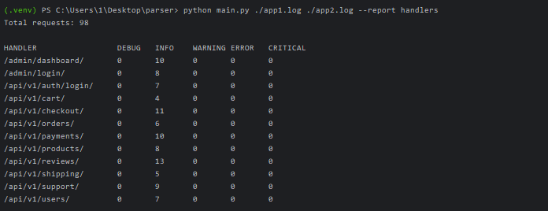

# Django E-commerce Application

## Установка

```bash
pip install -r requirements.txt
```

## Использование

```bash
python main.py <путь к логам> [<путь к логам> ...] --report <название отчета>
```

### Пример:

```bash
python main.py logs/app1.log logs/app2.log logs/app3.log --report handlers
```

### Использование
```bash
python main.py <путь к логам> [<путь к логам> ...] --report <название отчета> --<формат отчета> <название отсчета>.<формат отчета>
```

### Пример:

```bash
python main.py ./log1.log ./log2.log --report handlers --csv example.csv
```

## Доступные отчеты

### handlers
Отчет о состоянии ручек API по каждому уровню логирования. Показывает количество запросов к каждому эндпоинту с разбивкой по уровням логирования (DEBUG, INFO, WARNING, ERROR, CRITICAL).

## Разработка

### Запуск тестов

```bash
pytest
```

### Пример вывода



## Для добавление новых классов отчётов

### 1. Создать класс отчета:
- Создать новый класс, наследующийся от базового класса Report в файле log_analyzer/reports.py.
- Определить атрибут name для идентификации отчёта в командной строке.
- Реализовать метод generate(), который принимает список файлов логов и возвращает строку с отчётом.
### 2. Создать форматтер отчета (опционально):
- Если логика форматирования отчёта сложная, создать отдельный класс форматтера.
- Реализовать в нём метод format(), который принимает данные отчёта и возвращает строку.

### 3. Создать модель отчета (если нужно)
- Если существующая модель HandlersReport не подходит, создать новую модель отчёта в log_analyzer/models.py.
- Использовать декоратор @dataclass для удобства.
- Добавить нужные поля и методы для работы с данными отчёта.

### 4. Обновить парсер (если нужно)
- Если требуется извлекать из логов новую информацию, дополнить функции парсинга в log_analyzer/parser.py.

### 5. Зарегистрировать отчет
- Добавить новый отчёт в функцию get_available_reports() в файле main.py.

### 6. Дополнить экспорт в CSV (опционально)
- Если нужно, добавить поддержку экспорта нового типа отчёта в CSV в функцию export_to_csv().
- Возможно, потребуется сделать функцию более универсальной или создать отдельную для нового типа отчёта.

### 7. Добавить тесты
- Написать тесты для нового класса отчёта и форматтера в папке tests/(можно дополнить в уже существующие файлы).
- Проверить работу с разными типами входных данных.

### Основные компоненты, которые должны быть реализованы:
- Класс отчёта (обязательно)
- Класс модели отчёта (по необходимости)
- Класс форматтера отчёта (по необходимости)
- Функцию для парсинга специфичных данных (по необходимости)
### При этом общая архитектура приложения должна остаться неизменной, то есть приложение парсит логи, создаёт модель отчёта, форматирует отчёт и выводит результат в консоль или сохраняет в CSV файл.